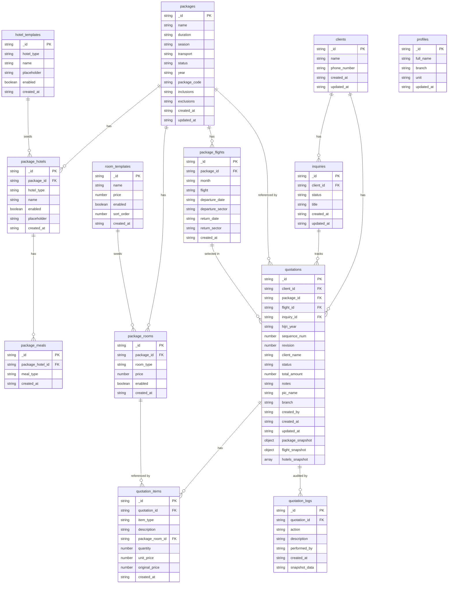

# Schema ERD

## Relationship Notes

| Relationship | Type | Note |
|---|---|---|
| `clients` → `inquiries` | one-to-many | A client can have multiple inquiries |
| `clients` → `quotations` | one-to-many | A client can have multiple quotations |
| `inquiries` → `quotations` | one-to-many | An inquiry can produce multiple quotations |
| `packages` → `package_flights` | one-to-many | A package has multiple flight schedules |
| `packages` → `package_hotels` | one-to-many | A package has multiple hotel configurations |
| `packages` → `package_rooms` | one-to-many | A package has multiple room types |
| `package_hotels` → `package_meals` | one-to-many | A hotel config has multiple meal options |
| `hotel_templates` → `package_hotels` | seed only | Templates seed new packages, no hard FK |
| `room_templates` → `package_rooms` | seed only | Templates seed new packages, no hard FK |
| `packages` → `quotations` | one-to-many | Denormalized via `package_id` string + `package_snapshot` |
| `package_flights` → `quotations` | one-to-many | Denormalized via `flight_id` string + `flight_snapshot` |
| `quotations` → `quotation_items` | one-to-many | Line items (rooms, add-ons, discounts) |
| `quotations` → `quotation_logs` | one-to-many | Full audit trail |
| `package_rooms` → `quotation_items` | one-to-many | Soft ref via `package_room_id` string |
